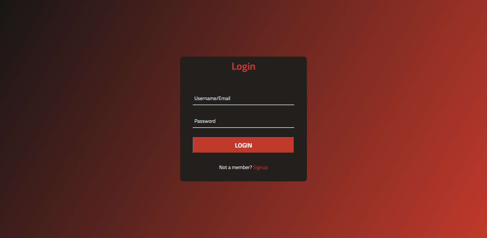
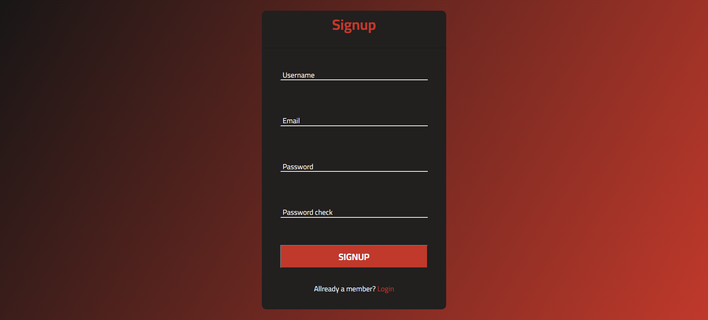
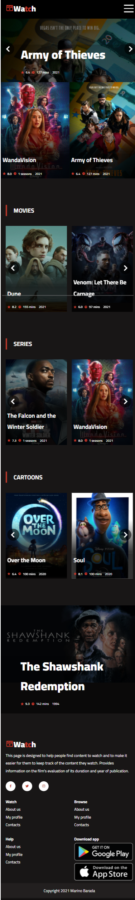

# MoviesSite

This is a web application called Watch and is intended for watching published movies and series. The user can log in to the application and register in case he does not have his account. During registration, the lengths and formats of the entered data (in Javascript) and their existence in the database are checked. (in PHP). Log in to the application is enabled by username or e-mail and the accuracy of this information is checked. In the application, we get a display of films and their basic data (year, title, review and duration or number of seasons).

## Tech Stack

**Client:** HTML, CSS, Javascript

**Server:** PHP, XAMPP, phpMyAdmin ,MySQLi

## Features

- Login/Registration
- check information entry for Login/Registration
- responsive design (mobile/desktop)
- Screening of released films and series
- friendly UX/UI design

## Screenshots
Login----------------------

Signup---------------------

Desktop--------------------

Mobile---------------------

## Appendix

The goals of this project are to acquire knowledge about creating a full-stack web application, and these goals were achieved by creating a beautiful and simple UI and connecting that interface with the database, and creating the appropriate backend.

## Authors

- [@MarinoBarada](https://github.com/MarinoBarada)

